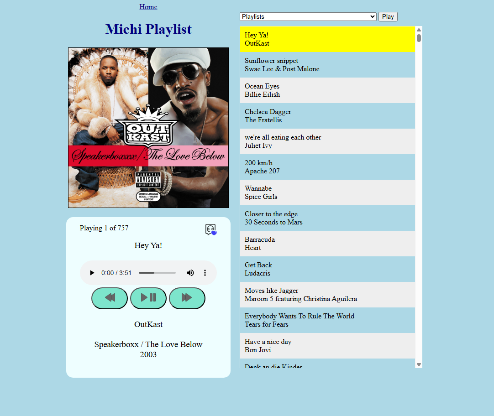
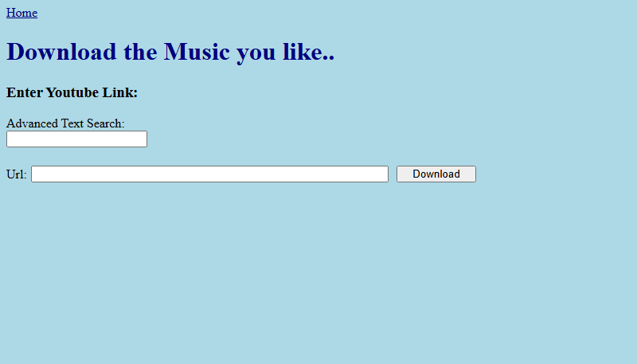

# MP3 Web Player (Michi-Playlist)

**Michi-Playlist** is an MP3 web player which allows me to play my old songs
from my young years in the web browser. It was a fun project to do a web player
myself instead of using a pre existing one. It has basic audio player
functionalities and comes with a download feature to auto tag the MP3 files
with title/artist name/album name and cover.

Core features:

- Basic MP3 Web Player in HTML and Javascript
- Session Navigator for Play/Pause/Skip/Previous
- MP3 download via YouTube url
- Metadata of song gets added automatically
- Docker image


## Deploy / Install

The web player is completely dockerized. There may be some bugs due to
differences in software version and at this point it is not fully customizable
(e.g. name, colors etc.).

Before installing you may want to change the network definitions in the docker compose file.

```yaml
# docker-commpose.yml

...

# network definitions
networks:
    mynetwork:
        name: my-net
        # change this to false if you do not have a reverse proxy
        external: true
        # external: false

```


Build the image with:
```bash
sudo docker build -t michi-playlist:1.0 .
```

Run the container:
```bash
sudo docker compose up -d
```


## Login / Basic Auth

It is recommended to limit the access with Basic Authentication (.htpasswd) or
other types of logins. 

- Reverse Proxy with Basic Auth

## Issues

- **Smartphone Inactivity:** If you listen on your smartphone with the screen
  off the playlist can stop after some time. This is because the OS turns off
  background apps to save battery. The issue is discussed
  [here](https://stackoverflow.com/questions/34764102/html5-audio-javascript-stops-working-on-androidgoogle-chrome-when-screen-is-tu).


## Todo

- Code refactoring 
- German comments/code to english
- php version problem (executable has version number in it and if version
  changes it will break)
- maybe a yt-dlp updater on the webpage because it is anoying to update the
  image (yt-dlp sometimes is not working, then it needs to be updated)
- css style in one file (now all over the place)
- put together your own playlist (create/add/delete/move etc.)
- Update playlist metadata button (if you manually add audio)
- ...


# Images

### Web Player



### Download Section



